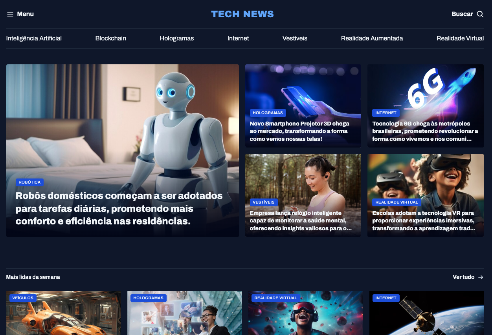

# 📰 News Portal

This is a project for a technology news portal, developed as part of an HTML and CSS study. The focus was on creating a responsive and semantically correct layout, using modern CSS concepts like Grid Layout.

## 📸 Screenshot



## ✨ Features

- Displays technology news in different sections (Featured, Most Read of the Week, AI Highlights, Seen This?).
- Responsive layout adaptable to different screen sizes.
- Semantic HTML structure.
- Styling with modern CSS (including CSS Grid).
- Use of custom fonts (Google Fonts - Archivo).

## 🛠️ Technologies Used

- HTML5
- CSS3 (with CSS Grid Layout)
- Google Fonts

## 📂 How to View

To view the project locally:

1.  **Clone the repository (if applicable):**

    ```bash
    # Replace with the actual URL of your repository, if any
    git clone https://github.com/eugeniobarrosjr/news.git
    cd news
    ```

    _If you already have the files locally, skip this step._

2.  **Navigate to the project folder:**

    ```bash
    cd news
    ```

3.  **Open the `index.html` file in your browser:**
    You can do this by double-clicking the file or using a terminal command (depending on your operating system):
    ```bash
    # Example for macOS
    open index.html
    # Example for Linux
    xdg-open index.html
    # Example for Windows
    start index.html
    ```

## 📃 License

This project is licensed under the MIT License.
